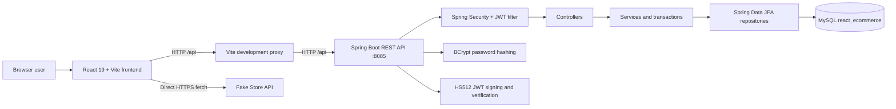
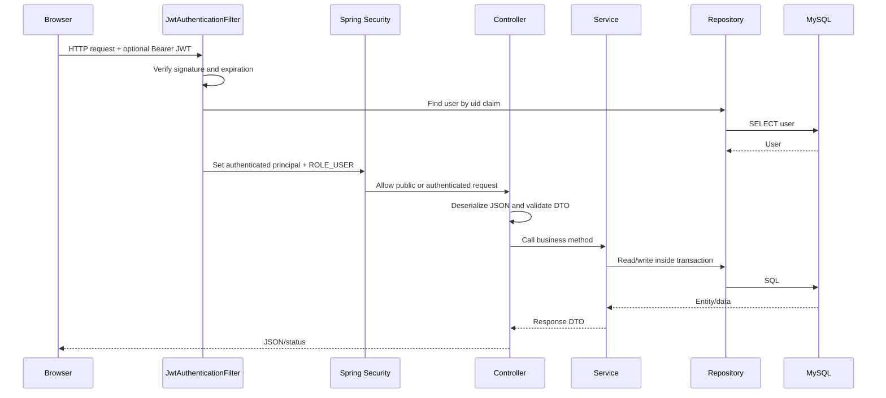
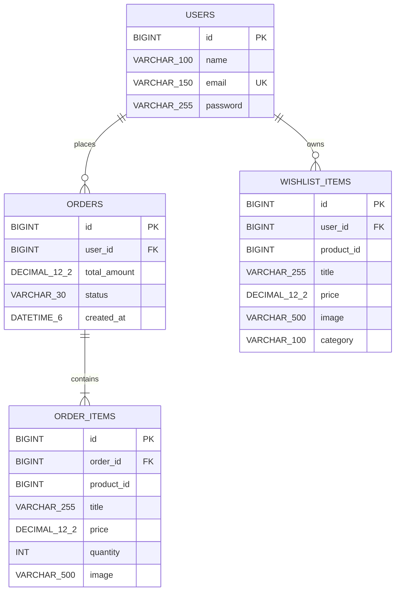
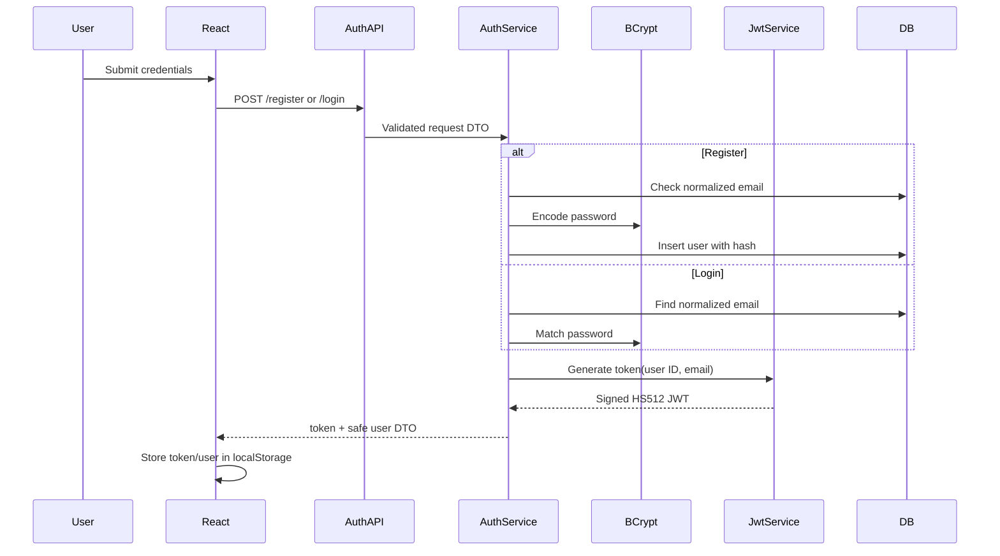

# React E-Commerce — Complete Project Documentation

This repository contains a full-stack e-commerce application named **MyStore**. It provides customer registration and login, an external product catalog, a persistent browser cart, a per-user wishlist, checkout that creates an order, and order history.

This document describes the **currently implemented code**, not a future or imagined feature set. In particular, the application does **not** currently process payments, manage inventory, or store products in MySQL.

> **Security notice:** The current `backend/src/main/resources/application.properties` contains development database credentials and a fixed JWT secret. Treat both as compromised, replace them before sharing or deploying the project, and never use the committed values in production.

---

## Table of contents

1. [Project overview](#project-overview)
2. [Implemented features](#implemented-features)
3. [System architecture](#system-architecture)
4. [Repository structure](#repository-structure)
5. [Technology stack](#technology-stack)
6. [Prerequisites](#prerequisites)
7. [Local development setup](#local-development-setup)
8. [Project workflow](#project-workflow)
9. [Database schema and design](#database-schema-and-design)
10. [Backend architecture](#backend-architecture)
11. [REST API reference](#rest-api-reference)
12. [Authentication, authorization, and JWT](#authentication-authorization-and-jwt)
13. [Security implementation](#security-implementation)
14. [Frontend architecture and functionality](#frontend-architecture-and-functionality)
15. [Configuration reference](#configuration-reference)
16. [Build, run, and test commands](#build-run-and-test-commands)
17. [Production deployment guidance](#production-deployment-guidance)
18. [Testing status](#testing-status)
19. [Security risks and recommended hardening](#security-risks-and-recommended-hardening)
20. [Known limitations and non-existent features](#known-limitations-and-non-existent-features)
21. [Troubleshooting](#troubleshooting)
22. [Glossary](#glossary)

---

## Project overview

### What the application does

A shopper can:

1. Browse a product catalog loaded from the external [Fake Store API](https://fakestoreapi.com).
2. Search products by title, filter by category, and sort by price or name.
3. Open a product detail page.
4. Add products to a cart and change quantities.
5. Create an account and receive a JWT immediately.
6. Log in or restore an existing browser session.
7. Add or remove products from a wishlist stored in MySQL.
8. Place an order, which is stored in MySQL together with item snapshots.
9. View the current user's order history.
10. View a simple profile page and log out.

### Important implementation boundary

The catalog and user-owned commerce data are handled differently:

- **Products** come directly from `https://fakestoreapi.com`; there is no backend product endpoint or `products` table.
- **Users, orders, order items, and wishlist items** are managed by the Spring Boot backend and stored in MySQL.
- **The cart** exists only in browser `localStorage`; it is not sent to the server until checkout.

This makes the project a functional e-commerce demo, but it is not yet a complete production shop.

---

## Implemented features

| Area | Status | Current behavior |
| --- | --- | --- |
| Product catalog | Implemented | Loaded from Fake Store API, not MySQL |
| Product search | Implemented | Case-insensitive title search in the browser |
| Category filtering | Implemented | Uses categories present in the loaded products |
| Product sorting | Implemented | Default, price low-to-high, price high-to-low, and name |
| Product details | Implemented | Image, title, category, price, rating, description, cart, and wishlist actions |
| Registration | Implemented | Creates a user, hashes the password, and automatically logs the user in |
| Login | Implemented | Email/password login with a generic invalid-credentials response |
| Session restoration | Implemented | Calls `GET /api/auth/me` when a stored token exists |
| Logout | Implemented locally | Deletes browser token/user state; does not revoke the JWT on the server |
| Route protection | Implemented | Checkout, orders, wishlist, and profile require a user |
| Cart | Implemented | Adds, removes, increments/decrements, totals, clears, and persists locally |
| Wishlist | Implemented | Per-user MySQL persistence with optimistic UI updates and rollback |
| Checkout | Implemented | Sends cart snapshots to the backend and creates an order |
| Order history | Implemented | Returns the current user's orders, newest first |
| Profile | Implemented | Displays stored name/email and links to orders/wishlist |
| Responsive UI | Partial | Core pages are styled, but there are no mobile media queries |
| Payment | Not implemented | No payment provider, payment form, or payment status |
| Shipping/address | Not implemented | Checkout only displays account name/email and order summary |
| Inventory | Not implemented | No stock table, stock checks, or reservations |
| Product administration | Not implemented | No admin role, product CRUD, or admin UI |
| Order status management | Not implemented | Every new order starts with `PLACED`; no update/cancel API |
| Refresh tokens | Not implemented | One long-lived access token is used for 24 hours |
| Email verification/password reset | Not implemented | No email or token workflow exists |

---

## System architecture

### High-level architecture



### Architectural boundaries

- The React application is a client of two different data sources:
  - Spring Boot for authentication, orders, and wishlist.
  - Fake Store API for products.
- Vite proxies browser requests beginning with `/api` to `http://localhost:8085` during development.
- Spring Boot exposes REST endpoints under `/api`.
- JPA/Hibernate maps Java entities to four MySQL tables.
- The browser stores the JWT, a display copy of the current user, and the cart in `localStorage`.
- The backend does not keep an HTTP session; it authenticates each protected request from the bearer token.

### Why the Vite proxy matters

The frontend calls relative paths such as `/api/auth/login`. During development, `frontend/vite.config.js` forwards `/api` to port `8085`. This keeps browser requests same-origin from the frontend's perspective and avoids depending on cross-origin behavior during normal local development.

Spring Boot also has a development CORS policy for localhost origins, but the Vite proxy is the primary local-development path.

---

## Repository structure

Generated directories such as `frontend/node_modules/`, `frontend/dist/`, and `backend/target/` are omitted below.

```text
react-ecommerce/
├── README.md
├── .github/
│   └── modernize/
│       └── java-upgrade/              # IDE/assistant Java-upgrade hook artifacts
├── backend/
│   ├── pom.xml
│   ├── .gitignore
│   └── src/main/
│       ├── java/com/ecommerce/backend/
│       │   ├── BackendApplication.java
│       │   ├── config/
│       │   │   └── SecurityConfig.java
│       │   ├── controller/
│       │   │   ├── AuthController.java
│       │   │   ├── OrderController.java
│       │   │   └── WishlistController.java
│       │   ├── dto/
│       │   │   ├── AuthResponse.java
│       │   │   ├── LoginRequest.java
│       │   │   ├── OrderItemRequest.java
│       │   │   ├── OrderRequest.java
│       │   │   ├── OrderResponse.java
│       │   │   ├── RegisterRequest.java
│       │   │   ├── UserResponse.java
│       │   │   └── WishlistItemRequest.java
│       │   ├── entity/
│       │   │   ├── User.java
│       │   │   ├── Order.java
│       │   │   ├── OrderItem.java
│       │   │   └── WishlistItem.java
│       │   ├── exception/
│       │   │   ├── ApiException.java
│       │   │   └── GlobalExceptionHandler.java
│       │   ├── repository/
│       │   │   ├── UserRepository.java
│       │   │   ├── OrderRepository.java
│       │   │   └── WishlistRepository.java
│       │   ├── security/
│       │   │   ├── JwtAuthenticationFilter.java
│       │   │   └── JwtService.java
│       │   └── service/
│       │       ├── AuthService.java
│       │       ├── OrderService.java
│       │       └── WishlistService.java
│       └── resources/
│           └── application.properties
└── frontend/
    ├── package.json
    ├── package-lock.json
    ├── vite.config.js
    ├── eslint.config.js
    ├── index.html
    ├── .env
    ├── .env.example
    ├── db.json                         # Legacy json-server data; not used by src/
    ├── public/
    │   ├── favicon.svg
    │   └── icons.svg
    └── src/
        ├── main.jsx
        ├── App.jsx
        ├── App.css
        ├── index.css
        ├── api/
        │   ├── client.js
        │   ├── authApi.js
        │   ├── orderApi.js
        │   ├── productApi.js
        │   └── wishlistApi.js
        ├── components/
        │   ├── Navbar.jsx
        │   ├── ProductCard.jsx
        │   └── ProtectedRoute.jsx
        ├── context/
        │   ├── AuthContext.jsx
        │   ├── CartContext.jsx
        │   ├── ProductContext.jsx
        │   └── WishlistContext.jsx
        └── pages/
            ├── Home.jsx
            ├── Products.jsx
            ├── ProductDetails.jsx
            ├── Cart.jsx
            ├── Checkout.jsx
            ├── Login.jsx
            ├── Register.jsx
            ├── Orders.jsx
            ├── Wishlist.jsx
            ├── Profile.jsx
            └── NotFound.jsx
```

### Repository notes

- `frontend/db.json` is left from an earlier `json-server` phase. Current `src/` code does not import or call it.
- The sample user in `db.json` has a plaintext password. It is not used by the Spring Security system and must not be treated as a real account store.
- `frontend/src/assets/hero.png`, `react.svg`, and `vite.svg` are not imported by the current application.
- `frontend/public/icons.svg` is not used by the current pages.
- There are no Docker files, database migration scripts, or CI/CD workflows in the current project.
- `.github/modernize/java-upgrade` contains Java-upgrade assistant hook scripts, not application runtime code.

---

## Technology stack

### Frontend

| Technology | Declared version | Purpose |
| --- | --- | --- |
| React | `^19.2.8` (lock: `19.2.8`) | UI component runtime |
| React DOM | `^19.2.8` (lock: `19.2.8`) | DOM renderer |
| React Router DOM | `^7.18.3` (lock: `7.18.3`) | Client-side routes and navigation |
| Vite | `^8.2.2` (lock: `8.2.2`) | Development server, bundler, and production build |
| `@vitejs/plugin-react` | `^6.1.0` (lock: `6.1.1`) | Vite React integration and Fast Refresh |
| ESLint | `^10.9.0` (lock: `10.9.1`) | JavaScript/JSX linting |
| `@eslint/js` | `^10.0.1` | ESLint recommended JavaScript rules |
| `eslint-plugin-react-hooks` | `^7.1.1` | React Hooks lint rules |
| `eslint-plugin-react-refresh` | `^0.5.4` (lock: `0.5.5`) | Vite React Refresh compatibility rules |
| `globals` | `^17.11.0` | Browser global definitions for ESLint |
| `@types/react` | `^19.2.18` | React type definitions; project is still JavaScript |
| `@types/react-dom` | `^19.2.4` (lock: `19.2.5`) | React DOM type definitions; project is still JavaScript |
| `json-server` | `^1.0.0-beta.15` | Legacy optional local mock server; not used by current app code |

The frontend is plain JavaScript with JSX. It does not use TypeScript, Redux, a component library, a CSS framework, React Query, or a component test framework.

### Backend

| Technology | Version | Purpose |
| --- | --- | --- |
| Java | `17` | Runtime and source language |
| Spring Boot | `3.5.16` | Application framework and dependency management |
| Spring Web MVC | Managed by Spring Boot | JSON REST controllers |
| Spring Security | Managed by Spring Boot | Request authentication and authorization |
| Spring Data JPA | Managed by Spring Boot | Repository abstraction |
| Hibernate ORM | Managed by Spring Boot/JPA starter | Entity mapping and schema generation |
| Spring Validation (Jakarta Bean Validation) | Managed by Spring Boot | DTO field validation |
| JJWT API/impl/Jackson | `0.12.7` | JWT creation, parsing, signing, and verification |
| MySQL Connector/J | Managed by Spring Boot runtime dependencies | MySQL JDBC driver |
| MySQL | Runtime database, designed for MySQL 8 | Persistent application data |
| Maven | Build tool; no wrapper is included | Dependency resolution and backend packaging |
| Spring Boot Test | Managed by Spring Boot | Test dependency; no test sources currently exist |
| Spring Security Test | Managed by Spring Boot | Security test dependency; no test sources currently exist |

The backend does not use Lombok, MapStruct, Flyway, Liquibase, Redis, Docker, or an external payment SDK.

### External services and tools

| Component | Role |
| --- | --- |
| MySQL | Users, orders, order items, and wishlist items |
| Fake Store API | Product catalog and individual product details |
| JJWT | JWT cryptographic operations |
| BCrypt via Spring Security | Password hashing |
| Vite development proxy | Forwards `/api` to Spring Boot during development |

---

## Prerequisites

Install the following tools:

- **Node.js** `^20.19.0` or `>=22.12.0`, as required by the installed Vite 8 version.
- **npm** compatible with the installed Node.js version.
- **JDK 17**.
- **Apache Maven** 3.x on `PATH`; this repository does not include `mvnw` or a Maven wrapper.
- **MySQL 8** running locally or a reachable MySQL-compatible server.
- Internet access for Maven/npm dependency downloads and Fake Store product requests.

The source is configured for Java 17. A newer JDK may work, but Java 17 is the verified project target.

---

## Local development setup

### 1. Start MySQL

The configured JDBC URL is:

```text
jdbc:mysql://localhost:3306/react_ecommerce
```

The URL contains `createDatabaseIfNotExist=true`, so Hibernate/JDBC can create the database if the configured MySQL account has permission. You can also create it explicitly:

```sql
CREATE DATABASE react_ecommerce
  CHARACTER SET utf8mb4
  COLLATE utf8mb4_unicode_ci;
```

Do not use the MySQL root account in a deployed environment. Create a least-privilege application account and provide it through environment variables.

### 2. Configure the backend safely

The repository's current `application.properties` includes local credentials. Override them through environment variables rather than committing real secrets.

#### PowerShell example

```powershell
$env:SPRING_DATASOURCE_URL = "jdbc:mysql://localhost:3306/react_ecommerce?createDatabaseIfNotExist=true&useSSL=false&allowPublicKeyRetrieval=true&serverTimezone=UTC&characterEncoding=utf8"
$env:SPRING_DATASOURCE_USERNAME = "your_mysql_user"
$env:SPRING_DATASOURCE_PASSWORD = "your_mysql_password"
$env:APP_JWT_SECRET = "a_base64_encoded_64_byte_random_secret"
$env:APP_JWT_EXPIRATION_MS = "86400000"
```

#### Bash example

```bash
export SPRING_DATASOURCE_URL='jdbc:mysql://localhost:3306/react_ecommerce?createDatabaseIfNotExist=true&useSSL=false&allowPublicKeyRetrieval=true&serverTimezone=UTC&characterEncoding=utf8'
export SPRING_DATASOURCE_USERNAME='your_mysql_user'
export SPRING_DATASOURCE_PASSWORD='your_mysql_password'
export APP_JWT_SECRET='a_base64_encoded_64_byte_random_secret'
export APP_JWT_EXPIRATION_MS='86400000'
```

Spring Boot's environment-variable mapping lets `APP_JWT_SECRET` override `app.jwt.secret` and lets the `SPRING_DATASOURCE_*` variables override the datasource properties.

A strong JWT secret should be random, Base64-encoded, and at least 64 bytes for the current HS512 setup. A JWT signing secret must never be placed in a frontend environment variable; all Vite `VITE_*` values are public in the built JavaScript.

### 3. Start the backend

In terminal 1:

```bash
cd backend
mvn spring-boot:run
```

Expected base URL:

```text
http://localhost:8085
```

On startup, Spring Boot:

1. Loads the datasource configuration.
2. Connects to MySQL.
3. Uses Hibernate `ddl-auto=update` to create or update mapped tables.
4. Registers the Spring Security filter chain.
5. Exposes the REST controllers under `/api`.

The first startup can take longer while Maven downloads dependencies.

### 4. Start the frontend

In terminal 2:

```bash
cd frontend
npm ci
npm run dev
```

Open the URL printed by Vite, normally:

```text
http://localhost:5173
```

If port `5173` is occupied, Vite may select the next available port.

### 5. Verify the application

1. Open the home page.
2. Open **Products** and confirm Fake Store products load.
3. Register a new account.
4. Confirm the navbar changes to show Wishlist, Orders, Profile, and Logout.
5. Add a product to the cart.
6. Add a product to the wishlist.
7. Place the order.
8. Confirm the cart clears and the order appears on `/orders`.

### Ports

| Service | Default port | Source |
| --- | ---: | --- |
| Spring Boot backend | `8085` | `backend/src/main/resources/application.properties` |
| Vite development server | `5173` or next free port | Vite default |
| MySQL | `3306` | Backend JDBC URL |
| Legacy `json-server` | `3000` | Only when manually running `npm run server` |

The Vite proxy target is fixed to `http://localhost:8085`. If you change the backend port, update `frontend/vite.config.js` as well.

---

## Project workflow

### Frontend startup workflow

`frontend/src/main.jsx` starts React in `StrictMode` and nests global providers in this order:

```text
StrictMode
└── AuthProvider
    └── CartProvider
        └── WishlistProvider
            └── ProductProvider
                └── App
                    └── BrowserRouter
                        ├── Navbar
                        └── Routes
```

The order matters:

- `WishlistProvider` needs the authenticated user from `AuthContext`.
- `ProductProvider` and all pages can consume the shared cart, auth, and wishlist state.
- The product provider is mounted globally, so the initial product fetch begins as soon as the application starts, not only when `/products` is opened.

### General backend request workflow



For a request with no bearer token, the JWT filter simply continues the chain. Public authentication endpoints can then run, while protected endpoints are stopped by Spring Security with `401 Unauthorized`.

### Registration workflow

1. The user submits name, email, and password on `/register`.
2. React's required/min-length attributes perform basic browser validation.
3. `AuthContext.register()` calls `POST /api/auth/register` without an Authorization header.
4. The backend validates all DTO fields with Jakarta Bean Validation.
5. `AuthService` trims the name, trims/lowercases the email, and checks for an existing email.
6. Spring Security's `BCryptPasswordEncoder` hashes the password.
7. JPA saves a `User` row.
8. `JwtService` generates a signed token for the new user's ID and email.
9. The API returns `201 Created` with the token and safe user details.
10. The frontend stores the token and user in `localStorage`, updates context state, and redirects to the requested page or `/`.

### Login workflow

1. The user submits email and password.
2. The frontend calls `POST /api/auth/login` without a token.
3. The backend normalizes the email, finds the user, and compares the submitted password to the BCrypt hash.
4. Unknown email and incorrect password both return the same `401` message: `Invalid email or password`.
5. On success, a new JWT is generated and returned with the user.
6. The frontend saves the session and returns to the route that originally required authentication.

### Session restoration workflow

This runs once when `AuthProvider` mounts:

1. Read the user-shaped JSON from `localStorage.user`.
2. Read `localStorage.token`.
3. If no token exists, clear the stored user and finish loading.
4. If a token exists, call `GET /api/auth/me` with `Authorization: Bearer <token>`.
5. If `/me` succeeds, replace the local user with the backend's current user representation.
6. If it fails, delete both token and stored user and treat the visitor as logged out.
7. `ProtectedRoute` waits for this process before redirecting.

The cached user is only an initial display value. The `/me` call is the session validity check.

### Product browsing workflow

1. `ProductProvider` calls `GET https://fakestoreapi.com/products` on mount.
2. Products are kept in React state.
3. The product page filters the in-memory array by lowercase title substring and exact category.
4. A second sort pass orders the filtered copy by ascending price, descending price, or title.
5. Clicking **View Details** navigates to `/products/:id`.
6. `ProductDetails` independently calls `GET https://fakestoreapi.com/products/:id`.
7. Loading, fetch errors, rating, and product information are rendered by the page.

There is no backend product cache, product database, pagination, server-side search, or product validation.

### Cart workflow

The cart is global React state backed by `localStorage.cart`.

Operations:

- Adding a new product appends it with quantity `1`.
- Adding an existing product increments its quantity.
- The `+` control increments quantity.
- The `-` control decrements only while quantity is greater than `1`.
- **Remove** deletes the line.
- A successful checkout calls `clearCart()`.
- The navbar count is the sum of all line quantities.
- The displayed total is `sum(price * quantity)` using JavaScript numbers.

The cart is not scoped to a user, is not synchronized across devices, and is not stored in MySQL.

### Wishlist workflow

The wishlist is server-side and belongs to the authenticated user.

1. On login/session restoration, `WishlistProvider` calls `GET /api/wishlist`.
2. On logout, it clears the in-memory wishlist.
3. Adding a product immediately inserts a temporary item into UI state.
4. The frontend sends the product snapshot to `POST /api/wishlist`.
5. On success, the server representation replaces the temporary item.
6. On failure, the previous wishlist is restored and the error is retained in context.
7. Removing a product also updates optimistically and rolls back on failure.
8. Product IDs are compared as strings so numeric and string representations are both supported.
9. The wishlist page can move a stored item into the cart and then remove it from the wishlist.

The database guarantees one wishlist row per `(user_id, product_id)`.

### Checkout and order workflow

“Checkout” in this project means creating an order record; it does not collect a shipping address or charge a card.

1. A guest selecting checkout is redirected to login and returned to `/checkout` after login.
2. Checkout displays the authenticated user's name/email and the current cart summary.
3. It maps each cart line to:
   - `productId`
   - `title`
   - `price`
   - `quantity`
   - `image`
4. It posts those items and a client-calculated total to `POST /api/orders`.
5. The backend ignores the posted total and calculates a total from the posted item prices and quantities.
6. The backend creates an `Order` with status `PLACED`, creates `OrderItem` snapshots, and commits them in one transaction.
7. On success, the frontend clears its local cart and navigates to `/orders`.
8. On failure, the cart is retained and the API error is displayed.

### Order history workflow

1. The protected `/orders` page calls `GET /api/orders` once on mount.
2. The backend queries only orders whose `user_id` is the authenticated principal.
3. Results are sorted by `created_at` descending.
4. Each order displays its ID, local date/time, items, quantities, prices, and total.
5. There is no pagination, status filter, cancellation, invoice, or order-detail route.

### Logout workflow

Logout is entirely client-side:

1. Delete `localStorage.token`.
2. Delete `localStorage.user`.
3. Set the React user to `null`.
4. `WishlistProvider` observes the user change and clears its list.

The already-issued JWT remains cryptographically valid until it expires unless the signing secret is rotated or the user is deleted. There is no logout/revocation endpoint or server-side token denylist.

---

## Database schema and design

### Database engine and schema generation

- Database name: `react_ecommerce`.
- Database engine: MySQL, intended for MySQL 8.
- JPA/Hibernate setting: `spring.jpa.hibernate.ddl-auto=update`.
- Schema migrations: none; Flyway and Liquibase are not included.
- Hibernate Open Session in View: disabled.
- SQL formatting in Hibernate logs: disabled.

On startup, Hibernate creates missing tables and applies supported changes to mapped columns/constraints. `ddl-auto=update` is convenient for local development but is not a safe production migration strategy because it is not a versioned, reviewable migration history.

### Entity relationship diagram



`DATETIME_6` above is a logical representation. Hibernate's exact MySQL temporal type can vary with the resolved Hibernate version; use `SHOW CREATE TABLE` in the active database for the physical DDL.

### `users`

| Column | Java field/type | Constraints | Purpose |
| --- | --- | --- | --- |
| `id` | `Long` | Primary key, identity/auto-increment | Internal user ID and JWT `uid` |
| `name` | `String` | `NOT NULL`, max 100 | Display name |
| `email` | `String` | `NOT NULL`, unique, max 150 | Normalized login identifier |
| `password` | `String` | `NOT NULL`, default max 255 | BCrypt hash, never plaintext |

The `email` unique constraint creates a unique index. Registration and login normalize email to lowercase after trimming.

### `orders`

| Column | Java field/type | Constraints | Purpose |
| --- | --- | --- | --- |
| `id` | `Long` | Primary key, identity | Order ID shown in the UI |
| `user_id` | `User` | `NOT NULL`, foreign key to `users.id` | Owning customer |
| `total_amount` | `BigDecimal` | `NOT NULL`, precision 12, scale 2 | Server-recalculated order total |
| `status` | `String` | `NOT NULL`, max 30 | Initially always `PLACED` |
| `created_at` | `Instant` | `NOT NULL` | Order creation time, initialized to `Instant.now()` |

Orders are indexed by the database-generated foreign key for `user_id` where required by MySQL. There is no explicit order number, currency, payment ID, address, or update timestamp.

### `order_items`

| Column | Java field/type | Constraints | Purpose |
| --- | --- | --- | --- |
| `id` | `Long` | Primary key, identity | Order-line ID |
| `order_id` | `Order` | `NOT NULL`, foreign key to `orders.id` | Parent order |
| `product_id` | `Long` | `NOT NULL` | Fake Store product ID snapshot; not a product foreign key |
| `title` | `String` | `NOT NULL`, default max 255 | Product title at order time |
| `price` | `BigDecimal` | `NOT NULL`, precision 12, scale 2 | Unit price at order time |
| `quantity` | `Integer` | `NOT NULL` | Quantity ordered; validation requires at least 1 |
| `image` | `String` | Nullable, max 500 | Image URL/address at order time |

Order items snapshot the submitted product fields. There is no `products` foreign key, so historical rows remain even if the external catalog changes or disappears. The snapshot also means the database cannot independently verify that the submitted product ID, title, or price was genuine.

### `wishlist_items`

| Column | Java field/type | Constraints | Purpose |
| --- | --- | --- | --- |
| `id` | `Long` | Primary key, identity | Wishlist-row ID |
| `user_id` | `User` | `NOT NULL`, foreign key to `users.id` | Owning customer |
| `product_id` | `Long` | `NOT NULL` | External product ID |
| `title` | `String` | `NOT NULL`, default max 255 | Saved title |
| `price` | `BigDecimal` | `NOT NULL`, precision 12, scale 2 | Saved price |
| `image` | `String` | Nullable, max 500 | Saved image |
| `category` | `String` | Nullable, max 100 | Saved category |

A unique constraint enforces one row per `(user_id, product_id)`. Repository methods also scope reads, lookup, and deletion to the authenticated user.

### Relationship and cascade behavior

- `User` → `Order`: many-to-one, lazy, mandatory. There is no cascade from user to orders, so user deletion is not configured to delete order history.
- `Order` → `OrderItem`: one-to-many, lazy, with `CascadeType.ALL` and `orphanRemoval=true`.
  - Saving an order persists its new items.
  - Removing an item from the order collection deletes the child row on flush.
- `User` → `WishlistItem`: many-to-one, lazy, mandatory. There is no cascade from user to wishlist entries.
- There is no `Product` entity and therefore no product relationship, product deletion policy, or stock constraint.

### Transaction boundaries

| Service method | Transaction | Purpose |
| --- | --- | --- |
| `AuthService.register` | Read/write | Check email, hash and save user, create response token |
| `AuthService.login` | Read-only | Find user and verify password |
| `AuthService.me` | Read-only | Map authenticated user to response DTO |
| `OrderService.placeOrder` | Read/write | Build order/items, calculate total, persist all |
| `OrderService.myOrders` | Read-only | Query and map current user's orders |
| `WishlistService.myWishlist` | Read-only | Query and map current user's wishlist |
| `WishlistService.add` | Read/write | Find existing or insert wishlist row |
| `WishlistService.remove` | Read/write | Delete matching user/product row |

Because Open Session in View is disabled, lazy order items are mapped to response DTOs while the service transaction is still open.

### Database design limitations

- Product prices and titles come from the client at order time.
- The server recalculates only the arithmetic total; it does not recalculate prices from an authoritative catalog.
- Product IDs are unconstrained external identifiers, not database product foreign keys.
- There is no stock check, so unlimited quantities can be ordered.
- There is no database-level guarantee that an order has at least one item; that rule exists only in `OrderService`.
- Wishlist snapshots can become stale and are not refreshed from Fake Store.
- String fields do not all have matching Bean Validation length limits, so oversized input may fail at the database layer.
- There is no audit trail for order status changes because status changes are not implemented.

### Legacy `frontend/db.json`

`frontend/db.json` contains arrays named `users`, `wishlist`, and `orders` for the old `json-server` experiment. Current code does not use it:

- The frontend API modules call Spring Boot, not port `3000`.
- Spring Boot does not read `db.json`.
- Its plaintext sample password is not BCrypt and is unrelated to backend authentication.

It should be treated as sample/legacy data only.

---

## Backend architecture

### Layering

```text
HTTP request
   ↓
Spring Security filter chain
   ↓
Controller
   ↓
DTO validation and deserialization
   ↓
Service transaction
   ↓
Spring Data JPA repository
   ↓
Hibernate / MySQL
   ↓
Response DTO / global error response
```

### Packages

| Package | Responsibility |
| --- | --- |
| `config` | Security filter chain, BCrypt encoder, and CORS |
| `controller` | HTTP routes and status codes |
| `dto` | Request/response records and validation annotations |
| `entity` | JPA database mappings |
| `exception` | Business exception and global HTTP error mapping |
| `repository` | Spring Data database operations |
| `security` | JWT generation/parsing and authentication filter |
| `service` | Authentication, order, and wishlist business logic |

### DTO and entity separation

Controllers do not return the `User` entity. Authentication uses `UserResponse`, which contains only `id`, `name`, and `email`; therefore the BCrypt password hash is not included in the normal auth response.

Order and wishlist services similarly map entities into response records. The JPA `order` and `user` backreferences are also annotated with `@JsonIgnore` as an additional safeguard, although entity JSON serialization is not the normal response path.

### Validation rules

Jakarta Bean Validation is applied to request bodies with `@Valid`; nested order items use `@Valid` as well.

The global exception handler returns the first field-validation message in this shape:

```json
{
  "message": "fieldName: validation message"
}
```

Examples include:

- `name: Name is required`
- `email: Email must be valid`
- `password: Password must be at least 6 characters`
- `productId is required`
- `quantity must be at least 1`

The backend does not currently validate maximum string lengths matching every database column.

---

## REST API reference

### Base URL and conventions

- Development base URL: `http://localhost:8085/api`
- All application endpoints use JSON.
- Protected endpoints require `Authorization: Bearer <JWT>`.
- Public authentication endpoints do not require a token.
- All `OPTIONS` requests are permitted for CORS preflight.
- Timestamps are returned as ISO-8601 strings generated from `Instant`.
- Successful protected requests identify the user from the JWT-loaded database entity; clients do not send a user ID for ownership.

### Error response format

Most errors use:

```json
{
  "message": "Human-readable error"
}
```

| Status | Typical use |
| ---: | --- |
| `200 OK` | Successful login, read, or update |
| `201 Created` | Registration, order creation, or wishlist add |
| `204 No Content` | Wishlist removal |
| `400 Bad Request` | DTO validation, malformed JSON, empty order service error, or invalid path type |
| `401 Unauthorized` | Missing/invalid/expired JWT or invalid login |
| `403 Forbidden` | Spring Security access denied response; no role-protected endpoint currently exists |
| `404 Not Found` | Unknown backend resource |
| `409 Conflict` | Duplicate email or database integrity conflict |
| `500 Internal Server Error` | Unexpected unhandled exception; details are logged but not returned |

### Authentication API

#### `POST /api/auth/register`

Access: public.

Request:

```json
{
  "name": "Example User",
  "email": "example@example.com",
  "password": "example123"
}
```

Validation and processing:

- `name`: nonblank; trimmed before storage.
- `email`: nonblank and valid email format; trimmed and lowercased.
- `password`: nonblank and at least 6 characters.
- Duplicate normalized email returns `409`.

Success: `201 Created`.

```json
{
  "token": "eyJhbGciOiJIUzUxMiJ9...",
  "user": {
    "id": 1,
    "name": "Example User",
    "email": "example@example.com"
  }
}
```

#### `POST /api/auth/login`

Access: public.

Request:

```json
{
  "email": "example@example.com",
  "password": "example123"
}
```

Success: `200 OK`.

```json
{
  "token": "eyJhbGciOiJIUzUxMiJ9...",
  "user": {
    "id": 1,
    "name": "Example User",
    "email": "example@example.com"
  }
}
```

Failure: `401 Unauthorized` with:

```json
{
  "message": "Invalid email or password"
}
```

#### `GET /api/auth/me`

Access: authenticated.

Headers:

```http
Authorization: Bearer <token>
```

Success: `200 OK`.

```json
{
  "id": 1,
  "name": "Example User",
  "email": "example@example.com"
}
```

There is no logout, refresh-token, password-change, or profile-update endpoint.

### Order API

#### `POST /api/orders`

Access: authenticated.

Request:

```json
{
  "items": [
    {
      "productId": 1,
      "title": "Example product",
      "price": 109.99,
      "quantity": 2,
      "image": "https://example.com/product.jpg"
    }
  ],
  "totalAmount": 219.98
}
```

Validation:

- `items` must be present, valid, and non-empty.
- `productId` must not be null.
- `title` must be nonblank.
- `price` must not be null and must be at least zero.
- `quantity` must not be null and must be at least one.
- `image` is optional.
- `totalAmount` is optional and ignored.

The backend computes:

```text
total_amount = Σ(item.price × item.quantity)
```

This prevents the client from directly declaring a different arithmetic total, but it does **not** make the submitted prices authoritative.

Success: `201 Created`.

```json
{
  "id": 10,
  "items": [
    {
      "productId": 1,
      "title": "Example product",
      "price": 109.99,
      "quantity": 2,
      "image": "https://example.com/product.jpg"
    }
  ],
  "totalAmount": 219.98,
  "status": "PLACED",
  "createdAt": "2026-09-23T10:15:30Z"
}
```

#### `GET /api/orders`

Access: authenticated.

Success: `200 OK` with an array of the current user's orders, newest first. An account with no orders receives `[]`.

There are no endpoints to get, update, cancel, refund, or ship an order by ID.

### Wishlist API

#### `GET /api/wishlist`

Access: authenticated.

Success: `200 OK`, sorted by `product_id` ascending.

```json
[
  {
    "productId": 1,
    "title": "Example product",
    "price": 109.99,
    "image": "https://example.com/product.jpg",
    "category": "electronics"
  }
]
```

#### `POST /api/wishlist`

Access: authenticated.

Request:

```json
{
  "productId": 1,
  "title": "Example product",
  "price": 109.99,
  "image": "https://example.com/product.jpg",
  "category": "electronics"
}
```

Validation:

- `productId` must not be null.
- `title` must be nonblank.
- `price` must not be null and must be at least zero.
- `image` and `category` are optional.

The operation is logically idempotent. If the user/product pair already exists, the existing row is returned without inserting a duplicate. Because the controller always returns `201 Created`, both a new item and an existing item use that status.

#### `DELETE /api/wishlist/{productId}`

Access: authenticated.

The path variable must be a `Long`. Deletion is idempotent: removing an absent item still returns `204 No Content` and no response body.

### Example authenticated request with curl

```bash
curl -X POST http://localhost:8085/api/orders \
  -H "Content-Type: application/json" \
  -H "Authorization: Bearer YOUR_TOKEN" \
  -d '{"items":[{"productId":1,"title":"Example product","price":109.99,"quantity":2}],"totalAmount":219.98}'
```

---

## Authentication, authorization, and JWT

### Password authentication

1. Registration uses `BCryptPasswordEncoder`.
2. The default BCrypt work factor is used.
3. Only the resulting hash is stored in `users.password`.
4. Login uses `passwordEncoder.matches(rawPassword, storedHash)`.
5. Unknown-email and wrong-password cases return the same API message to avoid distinguishing the two at that endpoint.

No plaintext password is returned by the API.

### JWT format and claims

`JwtService` creates a signed JWT with:

| Claim | Value |
| --- | --- |
| `sub` | Normalized user email |
| `uid` | Numeric user ID |
| `iat` | Token issue time |
| `exp` | Issue time plus configured expiration |

Current defaults:

- Signing family: HMAC SHA (`HS512`, selected because the configured key is 512 bits).
- Expiration: `86400000` milliseconds, or 24 hours.
- Key format: Base64-decoded bytes.

The implementation does not add or verify:

- `iss` issuer
- `aud` audience
- unique token ID (`jti`)
- token version
- refresh-token family
- explicit algorithm allowlist beyond the configured key/parser behavior

### Registration/login token flow



### JWT verification and request authentication

`JwtAuthenticationFilter` runs before `UsernamePasswordAuthenticationFilter`:

1. Read the `Authorization` header.
2. If it is missing or does not start with `Bearer `, continue without authentication.
3. Remove the `Bearer ` prefix and parse the token.
4. Verify the signature and standard time claims using the configured secret.
5. Read the custom `uid` claim as a `Number`.
6. Load the user from `users` by that ID.
7. If the user exists and no authentication is already set, create a `UsernamePasswordAuthenticationToken`.
8. Use the `User` entity as the principal.
9. Grant the synthetic authority `ROLE_USER`.
10. Store authentication in Spring's `SecurityContext` for the request.
11. If parsing/lookup fails, clear context and leave the request unauthenticated.

Because the filter reloads the user for each protected request, a token for a deleted database user no longer authenticates. The token's `sub` email is not compared with the current database email; authorization uses the loaded user ID.

### Authentication vs. authorization

**Authentication** answers “which database user is making this request?” It is performed by the JWT filter using the token's signed `uid` claim.

**Authorization** answers “what may that user do?” It is performed by the Spring Security request rules and service-level ownership queries:

- `/api/auth/login` and `/api/auth/register` are public.
- Every other backend request requires authentication.
- Orders are always queried by the authenticated `User`.
- Wishlist operations are always queried/deleted by authenticated `User` plus product ID.
- Request bodies do not allow clients to choose an owning user ID.
- Every authenticated user receives `ROLE_USER`.
- There is no admin/customer role model, role column, or method-level role restriction.

### Logout semantics

Logout is a browser operation. It does not contact Spring Boot and cannot invalidate an already-issued token. Treat the 24-hour token as valid until expiration, secret rotation, or user deletion.

---

## Security implementation

### Security filter chain configuration

`backend/src/main/java/com/ecommerce/backend/config/SecurityConfig.java` configures:

- CSRF protection disabled.
- CORS enabled for `/api/**`.
- Stateless session policy.
- Public login and registration endpoints.
- Public `OPTIONS` requests.
- Authentication required for all other requests.
- Form login disabled.
- HTTP Basic authentication disabled.
- JSON `401` and `403` responses instead of browser redirects/login pages.
- Custom JWT filter before the username/password filter.

### Why CSRF is disabled

The API is designed to use an `Authorization: Bearer` header rather than an automatically attached session cookie. Browser-generated cross-site requests do not automatically gain that header. Disabling Spring's cookie/session-oriented CSRF mechanism is therefore consistent with the current stateless token design.

If authentication is changed to cookies, CSRF protection must be reassessed rather than simply copied.

### CORS policy

For `/api/**`, allowed development origins are:

```text
http://localhost:*
http://127.0.0.1:*
```

Allowed methods:

```text
GET, POST, PUT, DELETE, OPTIONS
```

Other policy details:

- Any request header is allowed.
- Credentials are allowed.
- There is no environment-specific production origin configuration.

The current policy is convenient locally but is not an appropriate production trust boundary. Use exact HTTPS origins in deployed environments or serve frontend/backend from the same origin.

### Session security

- Spring HTTP sessions are disabled through `SessionCreationPolicy.STATELESS`.
- No `HttpSession` is used for login.
- Each request authenticates itself from the bearer token.

### Browser token storage

The frontend stores `token` and `user` in `localStorage`.

Advantages:

- Simple restoration after refresh.
- No cookie-based session endpoint.

Risks:

- Any successful same-origin XSS payload can read the token.
- Tokens are not automatically protected by the browser as `HttpOnly` cookies are.
- There is no token revocation after logout.

### Input and output handling

Implemented protections:

- Jakarta validation on request records.
- Password hashing rather than plaintext storage.
- Generic login failure message.
- User-scoped repository operations.
- Response DTOs that omit password hashes.
- Database unique constraints for email and wishlist membership.
- Generic `500` response text while detailed exceptions are logged.

Missing protections relevant to production:

- No rate limiting or account lockout on login/register.
- No maximum length validation matching all database columns.
- No numeric upper bound for quantities.
- No authoritative product/price validation.
- No malware/content checks because image fields are only stored strings.
- No request logging redaction policy for Authorization headers.
- No security-specific integration or authorization tests.

### Local-only TLS settings

The local JDBC URL uses:

```text
useSSL=false
allowPublicKeyRetrieval=true
```

Those settings simplify local MySQL setup but should not be copied to a remote production database without reviewing encryption, certificate validation, and network controls.

---

## Frontend architecture and functionality

### Routing

Routing is configured with `BrowserRouter` in `frontend/src/App.jsx`.

| Route | Access | Page | Function |
| --- | --- | --- | --- |
| `/` | Public | `Home` | Hero, feature cards, store description, Shop Now link |
| `/products` | Public | `Products` | Search/filter/sort and product grid |
| `/products/:id` | Public | `ProductDetails` | Fetches and displays one product |
| `/cart` | Public | `Cart` | Local cart management and total |
| `/login` | Guest-only in practice | `Login` | Login form and post-login redirect |
| `/register` | Guest-only in practice | `Register` | Registration and auto-login |
| `/checkout` | Authenticated | `Checkout` | Order summary and order creation |
| `/orders` | Authenticated | `Orders` | Current user's order history |
| `/wishlist` | Authenticated | `Wishlist` | Current user's saved products |
| `/profile` | Authenticated | `Profile` | User details and navigation |
| `*` | Public route shell | `NotFound` | 404 page and home link |

`ProtectedRoute` displays `Checking authentication...` while session restoration runs. A guest is redirected to `/login` with the current location in router state. Login and register then return to the saved pathname.

The redirect logic intentionally uses only `location.pathname`; query strings and fragments are not preserved.

### Global contexts

| Context | State/actions | Persistence/backend behavior |
| --- | --- | --- |
| `AuthContext` | user, loading, login, register, logout | Token/user in `localStorage`; verifies token with `/me` |
| `CartContext` | cart, add/remove, increase/decrease, clear | `localStorage` only; shared across users on the same browser profile |
| `ProductContext` | products, loading, error, retry | Fetches Fake Store API once globally; no persistence |
| `WishlistContext` | wishlist, loading, error, membership/toggle actions | Backend MySQL; optimistic updates and rollback |

All contexts use the native React Context API. There is no reducer, external state library, or server-state cache.

### API modules

| File | Responsibility |
| --- | --- |
| `api/client.js` | Base URL, token header, JSON serialization, error parsing |
| `api/authApi.js` | Register, login, and current-user calls |
| `api/orderApi.js` | Create and list orders |
| `api/productApi.js` | Direct Fake Store calls, separate from Spring client |
| `api/wishlistApi.js` | List, add, and remove wishlist items |

The central Spring client uses `VITE_API_BASE_URL` with a fallback of `/api`. Login/register explicitly disable Authorization attachment; other backend calls attach the stored bearer token when one exists.

Network failures are normalized to:

```text
Cannot reach the server. Is the backend running?
```

Non-2xx responses prefer the backend's `message` or `error` field. A `204` response returns `null` without parsing JSON.

### Page behavior

#### Home

- Static marketing content and Shop Now navigation.
- Does not load products itself; product loading comes from the global provider.

#### Products

- Displays a full-page loading state.
- Displays product-fetch errors with a **Try Again** button.
- Search is a case-insensitive title substring match.
- Categories are derived from current product data.
- Sorting is performed on the filtered array.
- Empty search/filter results show `No products found.`

#### Product details

- Refetches when the route `id` changes.
- Shows image, category, price, optional rating, and description.
- Shows a temporary `Added ✓` message for 1.5 seconds after cart insertion.
- Requires login before wishlist use.
- Disables the wishlist action while that request is pending.

#### Cart

- Supports item images, quantities, removal, and total.
- The decrement control never takes quantity below one; removal is the way to remove the final unit.
- Checkout navigation is available even to guests; protection occurs at `/checkout`.

#### Login and register

- Native form submission is prevented.
- Submit buttons are disabled and show progress text while requests run.
- API errors are displayed in the form.
- Browser-side required/email/min-length checks supplement backend validation.
- An already-authenticated visitor is redirected away.

#### Checkout

- Protected and only useful with a non-empty cart.
- Displays authenticated account details and item summary.
- No address, delivery option, coupon, tax, shipping, or payment inputs exist.
- Retains the cart if order creation fails.

#### Orders

- Loads once when the page mounts.
- Shows full-page loading and error states.
- Formats timestamps in the browser's locale.
- Displays only the data returned by the protected backend query.

#### Wishlist

- Displays current user's saved snapshots.
- Can move an item into the cart and remove it from the wishlist.
- Continue Shopping returns to `/products`.

#### Profile

- Shows current `user.name` and `user.email`.
- Links to orders and wishlist.
- Can log out and return home.

#### Not found

- Client-side 404 page for unmatched React routes.

### Browser storage keys

| Key | Value | Written by |
| --- | --- | --- |
| `token` | JWT string | Auth success and logout |
| `user` | JSON user `{id, name, email}` | Auth success, session restore, and logout |
| `cart` | JSON array of full product objects plus quantity | Every cart state update |

The cart stores full product snapshots, not just IDs. This allows rendering after refresh but can leave stale prices and product information.

### Styling and UI

- `src/index.css` resets the body margin.
- `src/App.css` contains all main visual styling.
- Layout uses CSS Grid and Flexbox.
- The product grid is fixed to four columns.
- The product detail layout is a horizontal two-column card.
- The visual style uses white cards, a dark navbar, gray page backgrounds, orange active links, and red logout/remove actions.
- Buttons and errors have simple custom styles.
- There is no animation framework, icon library, CSS-in-JS, utility CSS, theme system, or component library.
- There are no responsive media queries in the current `App.css`.

### Product API coupling

`frontend/src/api/productApi.js` directly calls:

```text
https://fakestoreapi.com/products
https://fakestoreapi.com/products/{id}
```

The backend has no `/api/products` routes. Therefore the current product data is not protected, cached, or transactionally related to orders and wishlist records.

---

## Configuration reference

### Backend properties

File: `backend/src/main/resources/application.properties`

| Property | Current purpose | Environment override |
| --- | --- | --- |
| `server.port=8085` | Backend HTTP port | `SERVER_PORT` |
| `spring.datasource.url` | MySQL JDBC URL | `SPRING_DATASOURCE_URL` |
| `spring.datasource.username` | Database account | `SPRING_DATASOURCE_USERNAME` |
| `spring.datasource.password` | Database password | `SPRING_DATASOURCE_PASSWORD` |
| `spring.datasource.driver-class-name` | MySQL driver class | Standard Spring property override |
| `spring.jpa.hibernate.ddl-auto=update` | Hibernate schema update strategy | `SPRING_JPA_HIBERNATE_DDL_AUTO` |
| `spring.jpa.open-in-view=false` | Keeps persistence context out of the web view | `SPRING_JPA_OPEN_IN_VIEW` |
| `spring.jpa.properties.hibernate.format_sql=false` | Compact Hibernate SQL logs | Standard Spring property override |
| `app.jwt.secret` | Base64 HMAC key | `APP_JWT_SECRET` |
| `app.jwt.expiration-ms=86400000` | Token lifetime in milliseconds | `APP_JWT_EXPIRATION_MS` |

Do not add secrets to frontend Vite variables. Vite embeds `VITE_*` variables into client assets.

### Frontend environment

File: `frontend/.env` or a local environment file:

```text
VITE_API_BASE_URL=/api
```

For a separately deployed HTTPS API, rebuild with for example:

```text
VITE_API_BASE_URL=https://api.example.com/api
```

The fallback in `api/client.js` is `/api`.

`frontend/.env.example` documents this value, but the frontend `.gitignore` currently ignores both `.env` and `.env.example`. Review that ignore rule if the example file is intended to be committed.

### CORS and proxy changes

- Backend port change: update both `server.port` and Vite's proxy `target`.
- Production same-origin: serve the frontend and `/api` behind one reverse proxy.
- Cross-origin production: update the backend CORS origin list to exact trusted HTTPS origins.

---

## Build, run, and test commands

### Frontend commands

Run from `frontend/`:

| Command | Behavior |
| --- | --- |
| `npm ci` | Installs exactly the lockfile versions |
| `npm run dev` | Starts Vite development server and `/api` proxy |
| `npm run lint` | Runs ESLint over JavaScript/JSX |
| `npm run build` | Creates the production bundle in `dist/` |
| `npm run preview` | Serves the built frontend locally |
| `npm run server` | Starts legacy `json-server` on port 3000; not used by current app |

For a clean reproducible frontend install, prefer `npm ci` over `npm install` when the lockfile is intended to be authoritative.

### Backend commands

Run from `backend/`:

| Command | Behavior |
| --- | --- |
| `mvn spring-boot:run` | Compiles and starts the development application |
| `mvn test` | Runs the Maven test phase |
| `mvn clean package` | Produces the executable JAR |
| `java -jar target/backend-0.0.1-SNAPSHOT.jar` | Runs the packaged backend |

No Maven wrapper is included, so `mvn` must be installed and available on `PATH`.

### Production frontend build

```bash
cd frontend
npm ci
npm run build
```

Vite writes static assets to `frontend/dist/`. A production web server must:

1. Serve those static files.
2. Support SPA fallback to `index.html` for React Router paths.
3. Either proxy `/api` to Spring Boot or use a full `VITE_API_BASE_URL` at build time.
4. Use HTTPS.

---

## Production deployment guidance

The current code is suitable as a local demonstration, but it should not be deployed unchanged.

### Minimum backend preparation

1. Rotate the committed database password and JWT secret.
2. Store secrets in a deployment secret manager, not source control.
3. Use a restricted MySQL user and a private database network.
4. Enable database TLS and validate certificates.
5. Replace `ddl-auto=update` with reviewed Flyway or Liquibase migrations.
6. Build with `mvn clean package` in CI.
7. Run the JAR behind HTTPS with a reverse proxy/load balancer.
8. Configure exact CORS origins or same-origin routing.
9. Add rate limiting, security headers, centralized logs, and monitoring.
10. Add an authoritative product/catalog service and transactional stock handling before accepting real orders.

### Minimum frontend preparation

1. Build with a correct public `VITE_API_BASE_URL`.
2. Serve over HTTPS with a strict Content Security Policy.
3. Configure SPA fallback.
4. Remove unused assets and legacy mock data.
5. Add responsive behavior and accessible focus/error states.
6. Review whether JWT storage should move to a secure cookie architecture.
7. Add tests around authentication, cart/checkout, wishlist rollback, and route protection.

### Real payments

There is no payment implementation. Integrating a payment provider requires additional work such as:

- Server-created payment intents/orders.
- Idempotency keys to avoid duplicate charges/orders.
- Webhook signature verification.
- Payment-state persistence and reconciliation.
- Inventory reservation and release.
- Refund, cancellation, tax, shipping, and address models.
- Compliance review for the selected provider and stored card/payment data.

Never collect raw card details directly in this application without a compliant, certified design.

---

## Testing status

### What exists

- Backend test dependencies for Spring Boot and Spring Security are declared.
- Frontend ESLint is configured.
- No backend `src/test` directory exists.
- No frontend unit, integration, or end-to-end test files are present.
- No test script is defined in `frontend/package.json`.

### What has been verified for this documentation update

- `npm run lint` completes successfully.
- `npm run build` completes successfully with Vite 8.2.2.
- The backend source is represented by an existing Maven build output, but Maven is not installed in the documentation environment, so `mvn test` was not executed there.

### Recommended test matrix

At minimum, add tests for:

- Registration normalization, duplicate users, and password hashing.
- Login success/failure and generic errors.
- JWT signature, expiration, malformed claims, deleted users, and role assignment.
- Public/protected route behavior and JSON `401`/`403` responses.
- User isolation for orders and wishlist entries.
- Empty/invalid/nested order validation.
- Server total calculation.
- Wishlist idempotency and concurrent uniqueness behavior.
- Transaction rollback.
- Frontend route redirects and session restoration.
- Cart persistence and quantity boundaries.
- Wishlist optimistic rollback.
- Checkout success/failure and cart retention/clearing.
- Product API failure and retry states.

---

## Security risks and recommended hardening

### Critical priorities before real commerce

#### 1. Rotate committed secrets

The application properties currently contain a database password and a fixed JWT signing secret. Anyone with repository access could potentially access the local database or forge tokens while those values remain valid.

Actions:

- Rotate the database password.
- Generate a new random 64-byte or stronger Base64 JWT key.
- Add environment-based secret injection.
- Ensure secret values never appear in logs, build artifacts, or frontend bundles.

#### 2. Make product and price data authoritative on the server

The current order endpoint trusts client-submitted product IDs, titles, images, and unit prices. Recalculating the total from client prices prevents one simple total manipulation, but a malicious client can still submit a low price or high quantity.

Actions:

- Add a backend product/catalog source.
- Accept product IDs and quantities only.
- Load current product records on the server.
- Calculate totals from trusted prices.
- Check stock and reserve inventory transactionally.
- Define how historical prices/taxes are captured.

#### 3. Protect authentication endpoints

Actions:

- Add rate limiting and progressive backoff for login/register.
- Consider generic duplicate-registration behavior to reduce account enumeration.
- Monitor repeated failures.
- Use short-lived access tokens and rotating refresh tokens, or a carefully designed secure-cookie session.

#### 4. Review token storage and revocation

LocalStorage tokens are exposed to XSS. There is also no server-side logout/revocation.

Actions:

- Enforce a strong Content Security Policy and eliminate injection sources.
- Consider `HttpOnly`, `Secure`, and appropriate `SameSite` cookies, with CSRF protection if cookies are used.
- Add token version/session records or a revocation strategy if immediate logout is required.
- Rotate signing keys with a controlled key ring if long-lived deployments need key rotation.

### Additional backend concerns

- Use migrations rather than `ddl-auto=update`.
- Add exact maximum lengths and numeric maxima to validation.
- Enforce currency and monetary scale/rounding rules.
- Use pagination for large wishlists/orders.
- Add authorization tests proving one user cannot access another user's data.
- Add a generic catch for security-filter failures that distinguishes token errors from database outages; the current filter catches all exceptions as authentication failure.
- Avoid `catch (Exception)` where narrower handling improves diagnostics.
- Add request correlation IDs and structured logs without tokens/passwords.
- Restrict CORS to exact production origins.
- Add rate limits and request-size limits at the reverse proxy/application boundary.
- Consider key rotation and secret scanning in CI.

### Additional frontend concerns

- Review every future product/display string rendered by React. React escapes text by default, but URL/image sources and future dangerous HTML rendering need deliberate handling.
- Do not use `dangerouslySetInnerHTML` for catalog data without sanitization.
- Avoid exposing detailed backend/database failures in production.
- Make wishlist requests concurrency-safe and handle rejected “move to cart” promises.
- Add responsive CSS and stronger accessibility semantics.
- Clear or namespace cart state when appropriate; it currently survives logout and is shared by all users on the same browser profile.
- Avoid persisting unnecessary full product objects; use a versioned cart shape and validation when reading storage.

---

## Known limitations and non-existent features

The following are explicitly **not** present in the current source:

- No `Product` entity, product table, or backend product CRUD.
- No product search/filter/sort endpoint; all catalog processing is client-side.
- No admin user, role field, or admin authorization rules.
- No payment gateway, card form, transaction, refund, or payment webhook.
- No shipping address, billing address, delivery method, or shipment tracking.
- No coupon, discount, tax, shipping-charge, or currency logic.
- No inventory/stock/reservation table or stock checks.
- No order update, cancellation, payment-state, fulfillment-state, or admin order API.
- No refresh token, logout endpoint, token denylist, or multi-device session management.
- No email verification, forgot/reset password, or account deletion.
- No profile update endpoint or editable profile form.
- No product reviews written by users.
- No recommendation logic.
- No pagination on orders or wishlist.
- No automated backend or frontend tests.
- No Docker, deployment manifest, reverse-proxy config, or CI/CD pipeline.
- No database migration tool or versioned schema scripts.
- No Redis/cache layer.
- No server-side cart.
- No product catalog fallback when Fake Store is unavailable.

---

## Troubleshooting

### Backend exits because MySQL is unavailable

Check:

- MySQL is running.
- Port `3306` is reachable.
- Database name and environment overrides are correct.
- The MySQL account exists and has permission to connect/create `react_ecommerce`.
- Password special characters are handled correctly by the environment rather than shell syntax.
- The JDBC URL is valid for the deployed MySQL version.

### Backend startup reports a JWT key error

The configured value must be valid Base64 and long enough for HMAC-SHA512. The current expected key size is at least 64 decoded bytes. Set a new `APP_JWT_SECRET` rather than copying the committed development key.

### Frontend says it cannot reach the server

Check:

- Backend is running on `8085`.
- `mvn spring-boot:run` did not fail during startup.
- Vite's proxy target is still `http://localhost:8085`.
- Browser network requests begin with `/api`.
- No local environment variable accidentally changes `VITE_API_BASE_URL`.
- Reverse proxy/development proxy configuration is available.

### Every protected request returns `401 Unauthorized`

Check:

- `localStorage.token` exists.
- The request contains `Authorization: Bearer <token>`.
- The token was signed with the current backend secret.
- The token has not passed its `exp` time.
- The token's `uid` still maps to an existing user.
- The browser and server clocks are not significantly different.
- If the secret changed after login, log out/login again or remove local session state.

### Product pages are empty or show fetch errors

The product API bypasses Spring Boot and directly calls Fake Store API. Check:

- Internet/DNS access to `https://fakestoreapi.com`.
- Whether the external API is available.
- Browser network/CSP restrictions.
- Product response shape compatibility.

### Vite says the Node version is unsupported

Use Node `^20.19.0` or `>=22.12.0` for the installed Vite version.

### Maven command is not found

Install Apache Maven and ensure `mvn` is on `PATH`. The repository does not include a wrapper.

### A direct browser refresh on `/orders` returns 404

React Router uses history navigation. The static server must rewrite unknown non-asset paths to `frontend/dist/index.html`. This is especially important in production.

### Registration returns `409 Conflict`

A user with that normalized email already exists, or another database uniqueness constraint failed. The frontend intentionally does not offer password reset or account recovery.

### Wishlist add returns a conflict during concurrent requests

The database composite uniqueness constraint protects against duplicate user/product rows. The service normally checks first and treats an existing row as success, but a true concurrent race can still be converted by the global handler into a generic `409`.

---

## Glossary

| Term | Meaning in this project |
| --- | --- |
| API | HTTP interface exposed by Spring Boot under `/api` |
| BCrypt | Spring Security password hashing algorithm used by `PasswordEncoder` |
| Bearer token | Credential sent as `Authorization: Bearer <JWT>` |
| Context provider | React component that exposes shared state/actions |
| DTO | Java record used as an HTTP request/response shape |
| Entity | JPA class mapped to a MySQL table |
| Hibernate | JPA implementation and schema generator used by Spring Data JPA |
| HS512 | HMAC using SHA-512; selected by JJWT for the current 64-byte key |
| JPA | Java Persistence API abstraction used through Spring Data repositories |
| JWT | Signed JSON Web Token containing user identity and expiry claims |
| MySQL | Relational database used for application-owned records |
| Optimistic update | UI changes before the server confirms and rolls back on failure |
| Principal | Authenticated `User` entity available to controllers |
| Snapshot | Product fields copied into order/wishlist records at save time |
| Stateless | Server does not store login state in an HTTP session |
| Vite proxy | Development forwarding of `/api` from frontend port to backend port |

---

## Source-of-truth files

When this README and code differ, use these files as the current implementation authority:

- Backend dependencies: `backend/pom.xml`
- Backend runtime/JWT settings: `backend/src/main/resources/application.properties`
- Security rules: `backend/src/main/java/com/ecommerce/backend/config/SecurityConfig.java`
- JWT behavior: `backend/src/main/java/com/ecommerce/backend/security/`
- API routes: `backend/src/main/java/com/ecommerce/backend/controller/`
- Business behavior: `backend/src/main/java/com/ecommerce/backend/service/`
- Database mappings: `backend/src/main/java/com/ecommerce/backend/entity/`
- Frontend dependencies/scripts: `frontend/package.json`
- Vite proxy: `frontend/vite.config.js`
- Frontend API base: `frontend/.env` / `frontend/src/api/client.js`
- Routes/guards: `frontend/src/App.jsx`, `frontend/src/components/ProtectedRoute.jsx`
- Shared state: `frontend/src/context/`
- User-visible behavior: `frontend/src/pages/`
